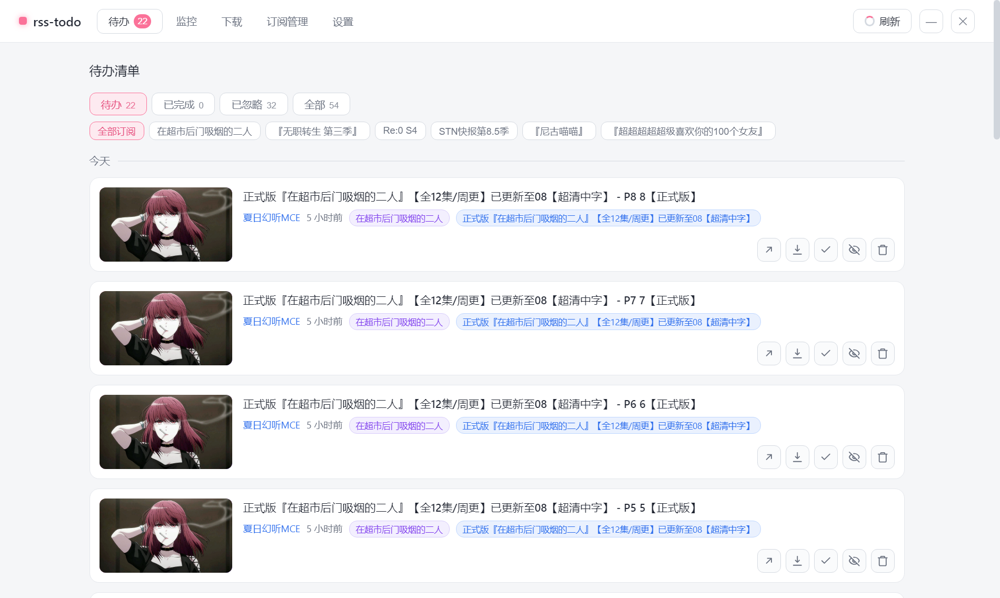
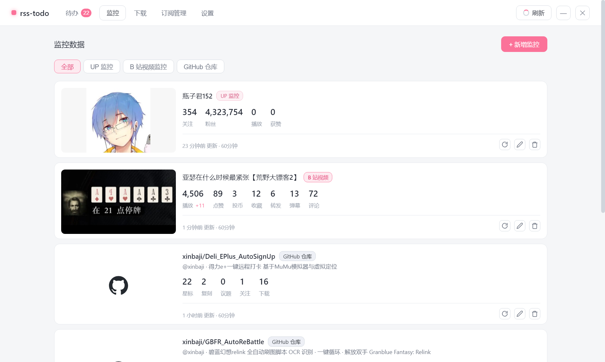
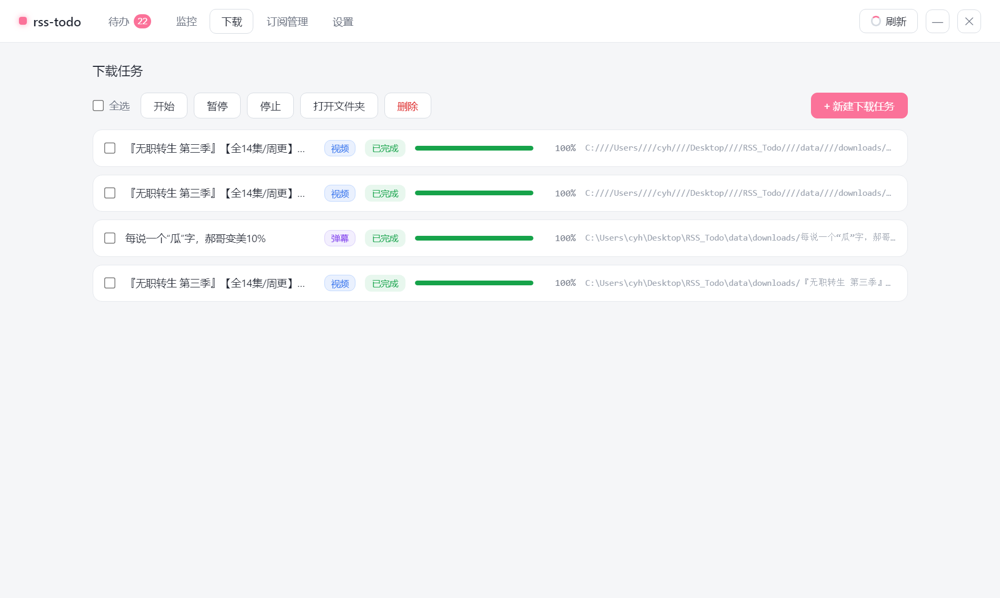
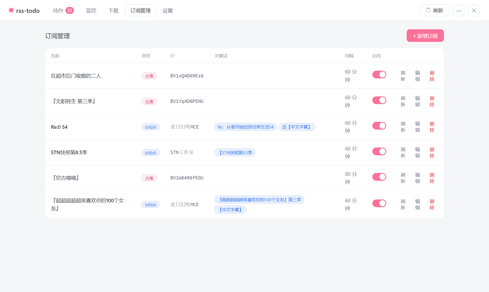
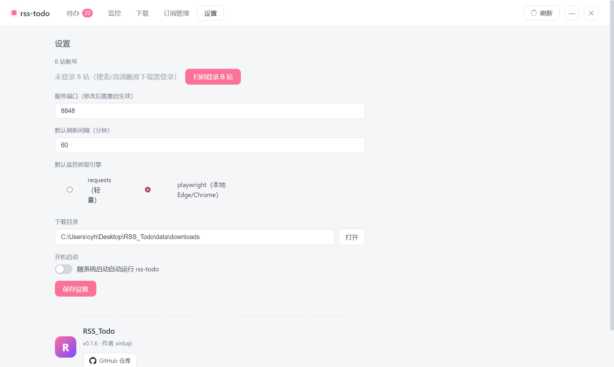

<div align="center">

# RSS_Todo

**B 站追番追更 · UP 数据监控 · 扫码登录的本地桌面应用**

把 B 站订阅从"刷到才看到"变成"自动送到你面前"。
本地单文件部署，零云端依赖，cookie 与数据全在你自己机器上。

<br>

[](https://github.com/xinbaji/RSS_Todo/releases/latest)
[](https://github.com/xinbaji/RSS_Todo/releases)
[](LICENSE)
[](https://github.com/xinbaji/RSS_Todo/releases)
[](https://www.electronjs.org/)

<br>

[**📥 下载安装包**](https://github.com/xinbaji/RSS_Todo/releases/latest) · [**📋 查看更新日志**](https://github.com/xinbaji/RSS_Todo/releases) · [**🐛 报告问题**](https://github.com/xinbaji/RSS_Todo/issues)

</div>

---

## 🖼 一图看全貌

<br>

<div align="center">

<br><br>
<i>待办清单 — 按订阅筛选 · 状态分类 · 一键打开 / 下载 / 完成 / 忽略 / 删除</i>
</div>

<br>

---

## ✨ 核心特性

<table>
<tr>
<td width="50%" valign="top">

### 📺 智能追番追更
- **UP 订阅** — 粘贴 UID/主页链接，按关键词匹配新视频
- **合集订阅** — 粘贴视频链接，自动订阅全部分 P
- 昵称自动识别、同名合并、级联清理
- 定时刷新（每条订阅可独立配置间隔）

</td>
<td width="50%" valign="top">

### 📊 多维数据监控
- **UP 监控** — 关注/粉丝/播放/获赞变化；开播高亮
- **B 站视频监控** — 播放/点赞/投币/收藏/弹幕/评论
- **GitHub 仓库** — 星标/复制/议题/关注/下载
- **任意网页** — XPath 自定义监控（playwright 复用本地 Edge）

</td>
</tr>
<tr>
<td width="50%" valign="top">

### ⬇️ 一键下载
- 内置 `yt-dlp` + `ffmpeg`，无需额外安装
- 进度可视化、批量管理、打开文件夹
- 任务独立运行，可暂停/继续/停止
- 视频/弹幕分开下载，文件名自动规范

</td>
<td width="50%" valign="top">

### 🔐 扫码登录
- B 站二维码扫码登录，自动保存 cookie
- 限流与风控友好（请求间隔自动退避）
- 登录态全本地，零云端中转
- 一键清除，零残留

</td>
</tr>
<tr>
<td width="50%" valign="top">

### 🎯 待办语义清晰
- **删除** = 彻底移除（下次刷新会重新加入）
- **忽略** = 保留不打扰（不删，下次刷新也不会再入）
- **已完成** = 标记完成（归档可见）
- 全局去重：同一视频无论来自哪个订阅只出现一次

</td>
<td width="50%" valign="top">

### 💾 数据本地化
- 单文件数据库（SQLite），无散落 JSON
- 配置 / 订阅 / 待办 / 下载任务 / 监控值统一管理
- 自动迁移旧版配置，向后兼容
- `data/` 目录已被 `.gitignore` 忽略

</td>
</tr>
</table>

<br>

---

## 📸 界面一览

### 1️⃣ 待办清单（主页）

<div align="center">

</div>

> 顶部 4 个状态切换：`待办 22` · `已完成 0` · `已忽略 32` · `全部 54`；下方按订阅分类筛选。每条卡片含封面、标题、作者、发布时间、来源订阅标签，右侧 5 个操作按钮（打开 / 下载 / 完成 / 忽略 / 删除）。

<br>

### 2️⃣ 监控数据

<div align="center">

</div>

> 三类监控并存：**UP 监控**（关注/粉丝/播放/获赞）、**B 站视频监控**（7 项指标 + 增量用粉色高亮，如「+11」）、**GitHub 仓库**（星标/复制/议题/关注/下载）。每条卡片右上角可编辑 / 立即刷新 / 删除。

<br>

### 3️⃣ 下载任务

<div align="center">

</div>

> 全选 / 开始 / 暂停 / 停止 / 打开文件夹 / 删除 批量操作。绿色进度条 + 100% 已完成徽章 + 文件绝对路径。右下角「+ 新建下载任务」可粘贴任意 BV 号。

<br>

### 4️⃣ 订阅管理

<div align="center">

</div>

> 一表看清所有订阅：名称 / 类型（合集 / bilibili）/ ID / 关键词 / 刷新间隔 / 启用开关 / 操作（刷新 / 编辑 / 删除）。右上角「+ 新增订阅」可粘贴主页或视频链接。

<br>

### 5️⃣ 设置

<div align="center">

</div>

> B 站扫码登录、服务端口、默认刷新间隔、抓取引擎（轻量 `requests` / 强力 `playwright` 复用本地 Edge/Chrome）、下载目录、开机自启，底部是应用元信息卡片。

<br>

---

## 🚀 快速开始

### 🪟 Windows 用户（推荐）

1. 前往 [**Releases**](https://github.com/xinbaji/RSS_Todo/releases/latest) 下载最新安装包
2. 解压或运行安装器（`RSS_Todo-v0.1.8.exe`，约 149 MB）
3. 启动 `RSS_Todo` → 自动打开主窗口
4. 打开「设置」页扫码登录 B 站
5. 打开「订阅管理」粘贴第一个 UP 主页或视频链接
6. 等待首次刷新（或点右上角「🔄 刷新」手动触发）
7. 新视频自动进入「待办清单」🎉

> 💡 **体积小贴士**：149 MB 的安装包已剔除 LICENSE、冗余 locales（只留 en-US）等共 56 个文件；Electron 自带的 Chromium 不可裁剪（无法复用系统 Edge/Chrome），要更小可改用纯后端单文件方案（见下文）。

### 🐍 开发者 / 源码运行

需要 Python 3.10+：

```bash
git clone https://github.com/xinbaji/RSS_Todo.git
cd RSS_Todo
pip install -r requirements.txt
python app.py                  # 自动打开 http://127.0.0.1:8848
# 或者指定端口 + 不开浏览器：
python app.py --port 9000 --no-browser
```

可选依赖（不装也能跑，只影响"页面 XPath 监控"功能）：

```bash
pip install playwright         # 复用本机 Edge/Chrome 无头模式，无需 chromium
```

> playwright 通过 `channel="msedge"` 复用你本机已装的 Edge，**不需要** `playwright install chromium`。

<br>

---

## 📦 打包发版

项目支持三种产物，按需选择：

| 方案 | 体积 | 适用场景 | 入口 |
|---|---|---|---|
| 🪟 Electron 桌面安装包 | ~149 MB | 日常用户分发 | `desktop/release/RSS_Todo-v*.exe` |
| 🐍 单文件后端 exe（带 kiosk 窗口） | ~88 MB | 想小一点、接受 Playwright 窗口 | `dist/RSS_Todo.exe` |
| 🐍 纯后端 + 浏览器访问 | 0（需装 Python） | 开发者调试 | `python app.py` |

### 本地打包

```bash
# 1) 打后端单文件 exe
python build_exe.py

# 2) 拷进 Electron 资源目录
mkdir -p desktop/resources
cp dist/RSS_Todo.exe desktop/resources/backend.exe

# 3) 装 Electron 依赖 + 打桌面安装包
cd desktop
npm install
npm run dist
# 产物: desktop/release/RSS_Todo-v{version}.exe
```

### GitHub Actions 自动发版

推送 commit message 含版本号（如 `feat: xxx v1.0.0`）到 `main`，自动触发 `.github/workflows/release.yml`：

- Windows runner 构建：Python 后端 exe 冒烟 → Electron 壳打包 → 发布 Release
- 资产命名：`RSS_Todo-v{version}.exe`（单文件安装包）

<br>

---

## ⚙️ 配置与数据

运行数据保存在 `data/` 目录（首次运行自动创建），**全部存进单一 SQLite 文件 `app.db`**：

| 表 | 用途 |
|---|---|
| `meta` | 应用配置（端口、cookie、刷新间隔、抓取引擎、下载目录等） |
| `subscriptions` | 订阅规则（JSON 存储） |
| `items` | 待办清单（含封面、作者、状态、关联订阅） |
| `seen_videos` | 已见历史（防重复入清单） |
| `downloads` | 下载任务与进度 |
| `monitor_rules` | 监控规则 |
| `monitor_values` | 监控历史快照（用于计算增量） |

> 📌 **v0.1.7 起**：`config.json` 不再生成，所有配置统一进 `meta` 表；旧版 `config.json` 会在首次启动时自动迁移后删除。
>
> `data/` 已被 `.gitignore` 忽略（含敏感 cookie），请勿手动提交。

<br>

---

## 🛠 技术栈

<div align="center">

| 层级 | 技术 |
|---|---|
| **桌面壳** | Electron 30+ · 无边框窗口 · 系统菜单与托盘 |
| **后端** | Python 3.10+ · Flask · APScheduler |
| **存储** | SQLite（`app.db` 单文件） |
| **抓取** | `requests`（轻量） · `playwright`（强力，XPath 监控） |
| **下载** | `yt-dlp` + `ffmpeg`（PyInstaller 打包内置） |
| **B 站** | bilibili-API-collect 思路 + 自研合集解析 + 官方 wbi 签名 |
| **前端** | 原生 JS（无框架） · CSS 变量主题 · 无构建步骤 |

</div>

<br>

---

## 📁 目录结构

```
RSS_Todo/
├── app.py                    # 入口（Flask + 调度器 + 自动开窗口）
├── core/                     # 后端核心
│   ├── adapters/             # bilibili / ugc(分P合集) 抓取适配器
│   ├── bilibili_login.py     # 扫码登录 + cookie 管理
│   ├── bilibili_stats.py     # 视频/UP 统计数据
│   ├── bilibili_ugc.py       # 合集分P解析
│   ├── config.py             # 配置（存于 app.db meta 表）
│   ├── storage.py            # SQLite 存储层
│   ├── scheduler.py          # 定时刷新（每订阅独立间隔）
│   ├── matcher.py            # 关键词匹配
│   ├── monitor.py            # 监控引擎（xpath / bilibili_stat）
│   ├── monitor_up.py         # UP 监控（直播 / 粉丝 / 播放 / 获赞）
│   ├── downloader.py         # yt-dlp 下载管理器
│   └── rules.py              # 订阅 / 监控规则 CRUD
├── web/                      # Flask 蓝图 + 前端
│   ├── server.py             # 全部 API 路由
│   ├── templates/index.html  # 单页结构
│   └── static/               # app.js + style.css
├── desktop/                  # Electron 桌面壳
│   ├── main.js               # 入口（开子进程后端 + 创建窗口）
│   ├── package.json          # electron-builder 配置
│   └── release/              # 打包产物
├── build_exe.py              # PyInstaller 后端打包脚本
├── .github/workflows/        # CI 自动发版
└── data/                     # 运行数据（git 忽略）
    └── app.db                # 一切配置的归宿
```

<br>

---

## 🤝 贡献

欢迎提 Issue / PR：

- 🐛 **Bug 反馈**：附上复现步骤 + 期望行为 + 实际行为
- 💡 **功能建议**：先开个 Issue 讨论方案，避免做无用功
- 🔧 **PR**：保持单一职责，附测试用例，跑通 `pytest` 再提

开发约定：

- 后端改动必须同时更新 `test/` 下对应单测
- 前端零依赖：不要引入构建工具，保持原生 JS + CSS 变量
- 体积敏感：`npm install` 后不要随便加新依赖

<br>

---

## 📄 License

[MIT](LICENSE) © [xinbaji](https://github.com/xinbaji)

<br>

<div align="center">

如果觉得好用，给个 ⭐ Star 吧 ✨

<br>

<sub>Made with ❤️ for chasing updates without endlessly refreshing bilibili</sub>

</div>
